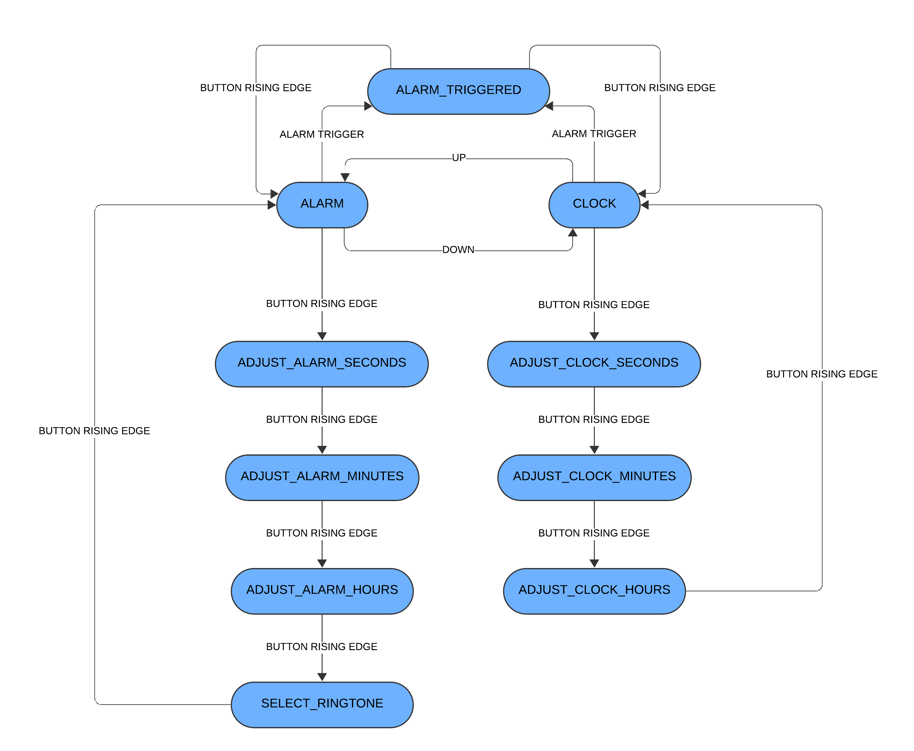

# Arduino Alarm Clock (FreeRTOS Port)

A modular Arduino Mega 2560 alarm clock that uses a Finite State Machine (FSM) to manage its operations, ported to run on **FreeRTOS**. User input is handled by a 2-axis joystick with a built-in button, and feedback is provided on a 16x2 character LCD.

This project is a direct port of the original [arduino-alarm-clock](https://github.com/RafaelRS04/arduino-alarm-clock) repository. It focuses on modularity and multitasking, utilizing FreeRTOS tasks and software timers for both the clock and the alarm buzzer.

## Features

  * **Time Display**: Shows the current time in HH:MM:SS format.
  * **Time Adjustment**: Set the current time using the joystick.
      * **Up/Down**: Increment/decrement the value by 1.
      * **Right/Left**: Increment/decrement the value by 10 (for faster setting).
  * **Alarm**: Set a daily alarm time. The alarm screen shows "DISABLED" if no alarm is set.
  * **Ringtone Selection**: Choose between different melodies (e.g., "Beeps" or "Everlong") for the alarm.
  * **Alarm Melody**: Plays a non-blocking, customizable melody when the alarm is triggered.
  * **Alarm Control**: The alarm can be silenced by pressing the joystick button.
  * **State-Driven UI**: The entire application is managed by a Finite State Machine (FSM) running in a dedicated task.

## Hardware Requirements

  * Arduino Mega 2560
  * 16x2 LiquidCrystal LCD Display (connected in 4-bit mode)
  * 10k&Omega; potentiometer (to adjust the LCD contrast)
  * 220&Omega; resistor (to limit the current for the backlight)
  * KY-023 Joystick module (or equivalent 2-axis analog joystick with digital button)
  * Piezo Buzzer module (passive)
  * Breadboard and jumper wires

## Arduino Libraries

  * [**FreeRTOS**](https://github.com/feilipu/Arduino_FreeRTOS_Library) by Richard Barry / Philip Stevens
  * [**LiquidCrystal**](https://www.arduino.cc/en/Reference/LiquidCrystal) by Arduino and Adafruit

## Project Structure

The source code is organized into modular components adapted for RTOS:

  * `main.cpp`: Initializes the FreeRTOS kernel, creates the `vFSM` and `vDisplayRefresh` tasks, and initializes synchronization primitives (Mutexes).
  * `Joystick.hpp` / `.cpp`: A class to manage the joystick. It handles reading analog values and detecting state changes within the FSM task.
  * `Clock.hpp` / `.cpp`: A module that manages timekeeping and alarm logic. It uses a FreeRTOS **Software Timer** to increment the time every second.
  * `Buzzer.hpp` / `.cpp`: A module for playing melodies. It uses a dynamic **Software Timer** to play notes at a set BPM without blocking the system.
  * `Ringtones.hpp`: Defines the available melodies and their note structures.
  * `FSM.hpp`: Defines the states for the Finite State Machine.
  * `debug.hpp`: A simple header containing a `LOG()` macro for conditional serial debugging.

## How It Works

### Finite State Machine (FSM) Task

The core logic resides in the `vFSM` task. It uses a `switch` statement based on a `current_state` variable to determine the system's behavior.

The joystick's button `xIsRisingEdge()` and direction `xMovedFromTo()` are used to transition between states.

The primary states are:

  * `CLOCK`: Default state, displays time.
  * `ADJUST_CLOCK_SECONDS` / `MINUTES` / `HOURS`: States for setting the time.
  * `ALARM`: Displays the currently set alarm time.
  * `ADJUST_ALARM_SECONDS` / `MINUTES` / `HOURS`: States for setting the alarm.
  * `SELECT_RINGTONE`: New state for choosing the alarm melody.
  * `ALARM_TRIGGERED`: Entered when the alarm time is reached. Plays the buzzer and waits for user input to stop it.

### FreeRTOS Timers & Tasks

This project relies on the OS scheduler to manage concurrency:

1.  **Clock Timer:** The `Clock` module creates a Software Timer that triggers every 1000ms. The callback increments the `ulTimeSeconds` counter and signals the FSM via a semaphore if the alarm time is reached.
2.  **Buzzer Timer:** The `Buzzer` module uses a one-shot Software Timer that is constantly re-armed with different periods corresponding to the duration of the musical notes. This allows complex melodies to play in the background without blocking the FSM or Display tasks.
3.  **Display Task:** A separate `vDisplayRefresh` task handles the slow LCD updates, ensuring that writing to the screen does not interfere with the responsiveness of the joystick or the timing of the music.